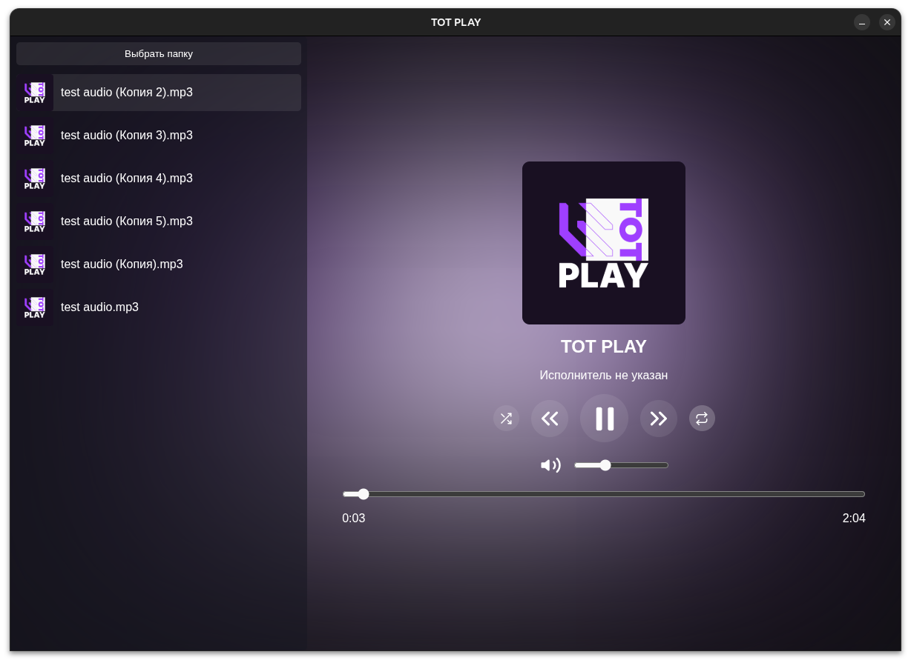

# TOT PLAY

Простой музыкальный проигрыватель на базе Electron. Поддерживает воспроизведение локальных файлов, случайное и повторное проигрывание.

---

## 🔍 Основные функции

- ✅ Выбор папки с музыкой
- 🔁 Повтор трека
- 🎲 Случайное воспроизведение
- 🎚 Регулировка громкости
- ⏱ Отображение времени
- 🖼 Отображение обложек альбомов

---

## 📦 Скачать

| ОС       | Версия                              |
|----------|-------------------------------------|
| Windows  | [Скачать .exe](dist/win/MyElectronApp Setup 1.0.0.exe) |
| Linux    | [Скачать .deb](dist/linux/myelectronapp_1.0.0_amd64.deb) |

> 💡 Убедись, что ты скачал последнюю версию из раздела [Releases](https://github.com/ ваш-никнейм/ваш-репо/releases)

---

## 🖼 Скриншоты

---

## 🛠 Технологии

- [Electron.js](https://www.electronjs.org/ )
- HTML / CSS / JavaScript
- electron-builder для сборки
